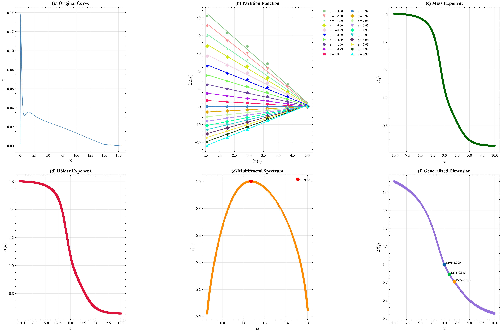
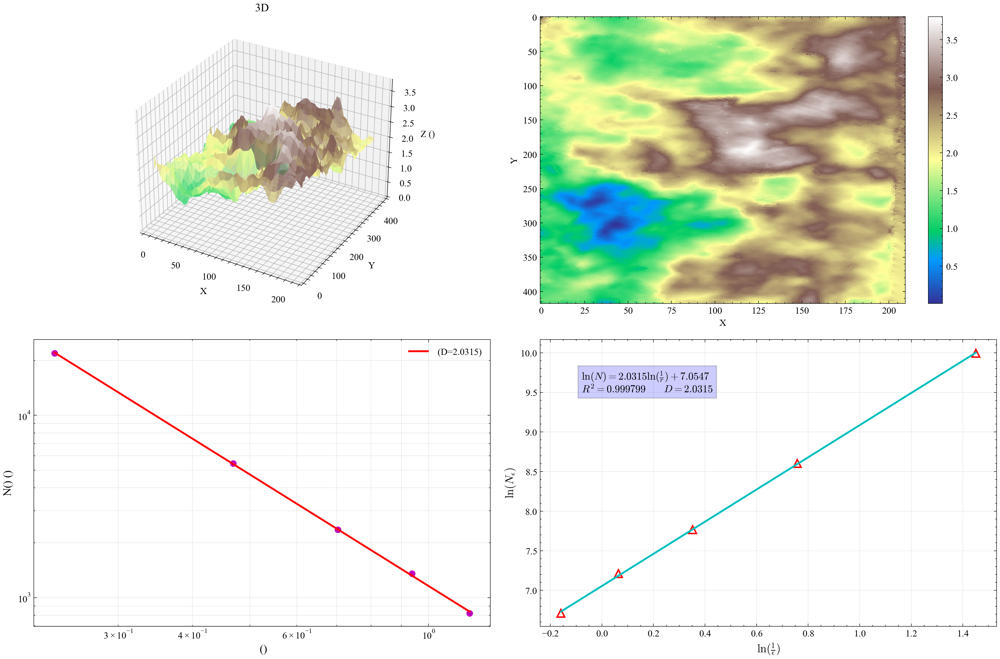
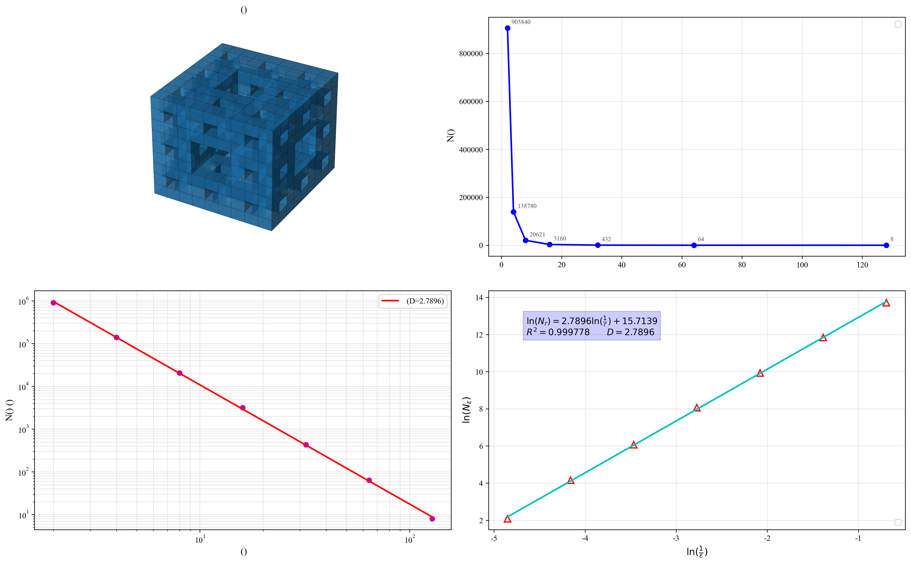

# Summary

FracDimPy is a comprehensive Python package for fractal dimension calculation and multifractal analysis. Fractal geometry provides powerful tools for characterizing irregular, self-similar structures that appear across scientific disciplines, from geological formations and material surfaces to biological systems and financial markets [@mandelbrotFractalGeometryNature1982; @lopesFractalMultifractalAnalysis2009]. FracDimPy offers a unified toolkit that integrates eight monofractal analysis methods, comprehensive multifractal analysis, and built-in fractal generation tools. The package is designed for both research and educational use, featuring an intuitive API, extensive documentation, and rich visualization capabilities built on NumPy, SciPy, Matplotlib, and pandas [@harrisArrayProgrammingNumPy2020; @virtanenSciPy1.0Fundamental2020; @hunterMatplotlib2D2007; @mckinneyPandasDataAnalysis2010].

The monofractal methods include box-counting with configurable boundary handling and partitioning strategies [@foroutan-pourAdvancesImplementationBoxcounting1999; @liebovitchFastAlgorithmDetermine1989], Hurst exponent via R/S analysis [@hurstLongTermStorageCapacity1951], detrended fluctuation analysis (DFA) [@pengMosaicOrganizationDNA1994], correlation dimension via the Grassberger-Procaccia algorithm [@grassbergerMeasuringStrangenessAttractors1983], information dimension, structural function, variogram, and sandbox methods. The multifractal module provides multifractal DFA (MF-DFA) [@kantelhardtMultifractalDetrendedFluctuation2002], multifractal spectrum computation for 1D curves and 2D images, and custom epsilon sequences for flexible scaling range optimization. The generator module produces deterministic fractals (Sierpinski triangle, Koch curve, Cantor set, Menger sponge) and stochastic fractals (fractional Brownian motion, Weierstrass-Mandelbrot functions) with known theoretical dimensions, enabling algorithm validation and educational demonstrations.

{width=100%}

# Statement of Need

Fractal and multifractal analysis has become increasingly important across scientific research, yet practitioners face significant challenges in accessing appropriate computational tools. Existing software is often fragmented across multiple packages with limited methodological coverage, or locked behind commercial licenses with steep learning curves [@lopesFractalMultifractalAnalysis2009].

While tools like Nolds [@nolds], Fathon [@fathon], and FracLab [@fraclab] provide excellent implementations of specific methods, FracDimPy offers a uniquely comprehensive suite that integrates monofractal and multifractal analysis within a single, well-documented package. This unified approach eliminates the need for researchers to learn multiple software environments and ensures consistent data handling across different analysis methods.

All implementations have been validated against canonical fractals with known theoretical dimensions---Sierpinski triangle ($D = \log 3/\log 2 \approx 1.585$), Koch curve ($D = \log 4/\log 3 \approx 1.262$), and Cantor set ($D = \log 2/\log 3 \approx 0.631$)---with relative errors consistently below 2\%. The package has been applied in geoscience (NMR pore-structure analysis, terrain characterization), materials science (surface roughness quantification), and petroleum engineering (reservoir heterogeneity assessment).

{width=48%}

{width=48%}

FracDimPy integrates seamlessly with the Python scientific ecosystem, enabling researchers to incorporate fractal analysis into existing NumPy/SciPy/Matplotlib workflows without additional dependencies beyond standard scientific Python packages. The GPL-3.0 license ensures broad accessibility for both academic and commercial applications.

# Acknowledgements

This work was prepared under the auspices of the National Key Laboratory of Oil and Gas Reservoir Geology and Exploitation at Southwest Petroleum University, and supported by the National Natural Science Foundation of China (52374044) and the Sichuan Province Science and Technology Planning Projects (2025JDDQ0002). We thank the open-source community for the essential scientific computing tools---NumPy, SciPy, Matplotlib, and pandas---that make this work possible, as well as the developers of Nolds, Fathon, and FracLab for inspiring aspects of this project.
